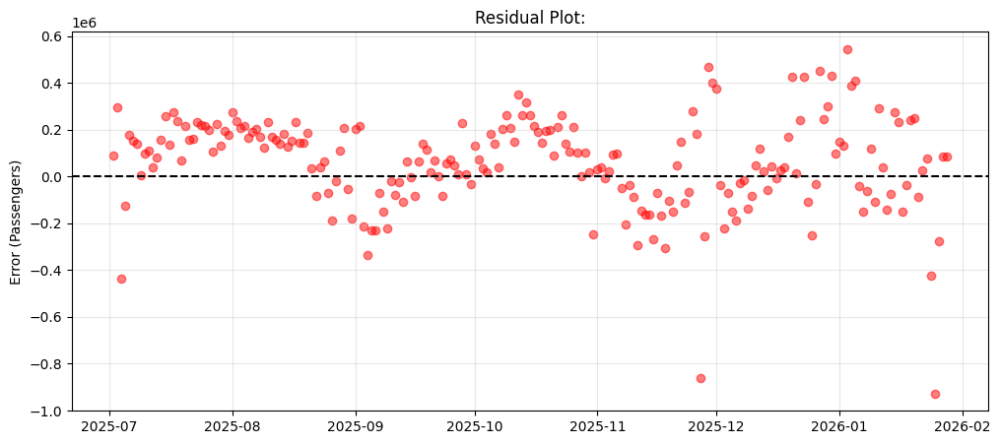

# Kalshi_ML_Purdue_Application
# TSA Passenger Volume Forecasting
**Predicting travel demand using Gradient Boosting and External Intent Data**

## 1. Executive Summary
This project aims to predict TSA passenger throughput using historical passenger volume data, external economic indicators (oil and jet fuel), and Google Search intent. The final model achieved a **MAPE of 6.76%**, demonstrating high reliability. As a result, the model could serve as an effective tool for aiding operational planning and resource management.

---

## 2. Methodology: Why Gradient Boosting?
While Deep Learning models such as LSTMs and RNNs are popular for time-series, I utilized **XGBoost (eXtreme Gradient Boosting)**. This library builds an ensemble of weak decision trees, where each subsequent tree is trained specifically to predict the residuals (errors) of the previous ones.

* **Why Gradient Boosting?** I chose a gradient-boosting architecture because TSA data is "tabular" in nature once features are extracted. Unlike Deep Learning, which requires large datasets to learn patterns, Gradient Boosting is highly efficient at identifying nonlinear relationships in smaller datasets without the need for complex hyperparameter tuning or expensive hardware. 
* **Why XGBoost over LightGBM?** While LightGBM is often preferred for massive datasets due to its leaf-focused growth, I opted for XGBoost for this specific project. With only a few years of daily data (~1,200 rows), LightGBM’s aggressive growth can lead to overfitting. XGBoost’s level-focused growth is more conservative and stable for this scale. 

Furthermore, neural networks (LSTMs) often suffer from vanishing gradients, in which the memory of past events washes out over long sequences. XGBoost avoids this by treating time lags as direct features, ensuring that the signal from 7 days ago is as clear as the signal from yesterday.

A final point to note is that there’s considerable noise in the 2022-2024 period due to erratic post-pandemic travel recovery and shifting inflation dynamics. XGBoost’s built-in L1 (Lasso) and L2 (Ridge) regularization were key to reducing this noise. They penalized the model for relying too heavily on anomalies from the recovery period, thereby forcing it to learn broader, more sustainable seasonal trends.

---

## 3. Feature Engineering
The key to the model’s performance lies in three categories of features: **Cyclical Temporal encoding**, **Holiday Proximity**, and **External Leading Indicators.**

1.  **Cyclical Temporal Encoding:** Simple labels (0-6 for days) create a mathematical "jump" between Sunday and Monday. By using sine and Cosine transformations, I mapped time onto a circle, ensuring that the model recognizes that December and January are adjacent.

2.  **Holiday Proximity:** It's not enough to look at a holdy by itself. In reality, the volume of plane flights is a wave. People will travel toward a destination 2-3 days before the holiday and return 1-2 days after. Thus, I implemented `Is_federal_holiday` and proximity flags to capture the buildup (2-3 days before) and the wind-down (1-2 days after) of holiday surges.
  
3.  **Leading Indicators:** I used search volumes for "flights", "expedia", "trivago", and "vacation" as a **1–3 week early-warning system**. Additionally, oil prices were used to approximate jet fuel costs passed on to consumers.

  
  
<i>Figure 1: Measure of the importance of each feature</i>

Regarding why so few features, though it’s tempting to add dozens of search terms and economic terms, the simplest explanation, involving the fewest assumptions, can often produce the best results. Adding too many low-importance features (like "car rental" searches) introduces "noise" that can dilute the high-impact signal of features like Lag_7 (importance of around 0.30). By starting with a sparse, high-impact feature set, I created a minimalistic model that was easier to debug. It allowed me to identify exactly where the model was failing (like the College Move-in dates) without wondering if a random, unimportant feature was confusing the training process.

---

## 4. Data Handling & Validation
### Maintaining Temporal Integrity
With time-series forecasting, we want to prevent the model from cheating by catching glimpses of the future during training. To achieved this, I implemented a validation and inference pipeline.

* **TimeSeriesSplit (5-Fold):** Instead of random shuffling, I used a walk and learn approach where the model is trained on an initial window of time and tested on the subsequent period, gradually expanding the training window. This approach also has the added beneift of better simulating real-world updates of new data.

* **Recursive Inference Loop:** I used a Recursive Inference Loop, where the model uses a 30-day seed of known historical data to predict the first day of the test set. It then feeds that prediction back into the feature set as the Lag_1 for the next day. This continues for the entire 211-day test period. While this approach is riskier because errors can compound over time, it is the only way to prove the model's viability for long-term operational planning. It forces the model to rely on its own internal logic and deterministic features (holidays, calendar cycles).

---

## 5. Results & Model Diagnostics
**Final Metric: 6.76% Mean Absolute Percentage Error (MAPE)**

  
  
<i>Figure 2: Comparsion of Model Predictions and Actual Volume</i>

### The Hierarchy of Importance
* **The Weekly Heartbeat (Lag_7):** Importance of **0.30**. These results indicate that travel is fundamentally a weekly habit, where the best predictor of a Friday rush is the previous Friday.

* **Theory vs. Reality:** Google Trends and Oil prices (Importance: **0.03–0.04**) acted as fine-tuning modifiers rather than primary drivers. In short, while search intent and fuel surcharges can signal that people want to travel, the calendar and historical rhythms dictate when they actually show up at the airport.

### Residual Analysis (Identifying Weaknesses)

  
  
<i>Figure 3: Residual map showing the variance between TSA actuals and recursive predictions</i>

* **Stationary Holidays:** The model over-predicted early January. It seems to have seen that the Holiday Flag and expected a rush, failing to realize travelers often stay put for several days once they reach their New Year destination.
* **The College Rush:** Under-predictions in late August/early September correlate to **College Move-in windows**, which are regional and not captured by national federal holiday calendars.
* **The Thanksgiving Dip:** The model missed the specific "quietness" of Thanksgiving Day. Future iterations could add a "Holiday-Eve" vs. "Holiday-Day" option, noting that the day of major holidays is often the quietest.

---

## 6. Lessons Learned & Future Roadmap
* **Meteorological Integration:** The decoupling of predictions during major storms suggests that a weather-risk API is the next step to adjust for mass cancellations. (Why I didn't include weather-risk at first, was kind of an oversight on my part. I was thinking people would plan trips months ahead, and tend to go regardless of weather. )
* **Demand Elasticity:** The low importance of Oil Prices (0.03) suggests that 1–6 month travel intent is remarkably **price-insensitive** once a holiday is planned.
* **Brand Sentiment:** Transitioning from "flights" to brand-specific terms (e.g., "Southwest flight status") could provide shorter-fused leading indicators.

### Final Conclusion
Ultimately, this project serves as a reminder of how 80% of the model’s efficiency can be derived from a thoughtful 20% of the features, in my case, autoregressive lags and cyclical time encoding. While it is tempting to use complex architectures such as Transformers or LSTMs, this project demonstrates that a well-tuned Gradient Boosting model, paired with rigorous feature engineering, can deliver high-quality results with significantly less computational overhead and greater transparency.

⡀⠤⢤⠤⢠⢀⠀⠀⠀⠀⠀⠀⠀⠀⠀⠀⠀⠀⠀⠀⠀⠀⠀⠀⠀⠀⠀⠀⠀⠀⠀⠀⠀⠀⠀⠀⠀⠀⠀
⠈⠲⣤⣄⡀⠈⠈⠔⣄⠀⠀⠀⠀⠀⠀⠀⠀⠀⠀⠀⠀⠀⠀⠀⠀⠀⠀⠀⠀⠀⠀⠀⠀⠀⠀⠀⠀⠀⠀
⠀⠀⠀⠉⠛⠿⣼⣴⠢⢣⠗⢢⠀⠀⠀⠀⠀⠀⠀⠀⠀⠀⠀⠀⠀⠀⠀⠀⠀⠀⠀⠀⠀⠀⠀⠀⠀⠀⠀
⠀⠀⠀⠀⠀⠀⠀⠉⠛⣾⣷⡖⠀⠉⢰⢀⠀⠀⠀⠀⠀⠀⠀⠀⠀⠀⠀⠀⠀⠀⠀⠀⠀⠀⠀⠀⠀⠀⠀
⠀⠀⠀⠀⠀⠀⠀⠀⠀⠈⠙⠳⢶⣦⠀⠈⠊⠐⡠⢀⠀⠀⠀⠀⠀⠀⠀⠀⠀⠀⠀⠀⠀⠀⠀⠀⠀⠀⠀
⠀⠀⠀⠀⠀⠀⠀⠀⠀⠀⠀⠀⠀⠈⣷⣶⣴⣦⣦⣥⣤⣤⣤⣤⣤⣤⣤⣤⣤⠤⠴⠒⠁⠀⠀⠀⠀⠀⠀
⠀⠀⠀⠀⠀⠀⠀⠀⠀⠀⠀⠀⠀⢸⣿⣿⣿⣿⣿⣿⣿⠿⠛⠯⡙⠩⢁⣦⡄⠀⠀⠀⢀⠀⠀⠀⠀⠀⠀
⠀⠀⠀⠀⠀⠀⠀⠀⠀⠀⠀⠀⠀⣿⣿⡿⠏⠉⠁⠉⠹⠿⢤⣧⡀⢀⠈⢧⣧⣧⣀⣤⣿⣼⣤⡤⣄⣀⣀
⠀⠀⠀⠀⠀⠀⠀⠀⠀⠀⠀⠀⠀⠈⠁⠀⠀⠀⠀⠀⠀⠀⠀⠈⠙⠻⣿⣿⣿⣿⣷⣯⡻⠟⠁⠁⠀⠀⠀
⠀⠀⠀⠀⠀⠀⠀⠀⠀⠀⠀⠀⠀⠀⠀⠀⠀⠀⠀⠀⠀⠀⠀⠀⠀⠀⠀⠈⠉⠉⠛⠛⠃⠀⠀⠀⠀⠀⠀ 
